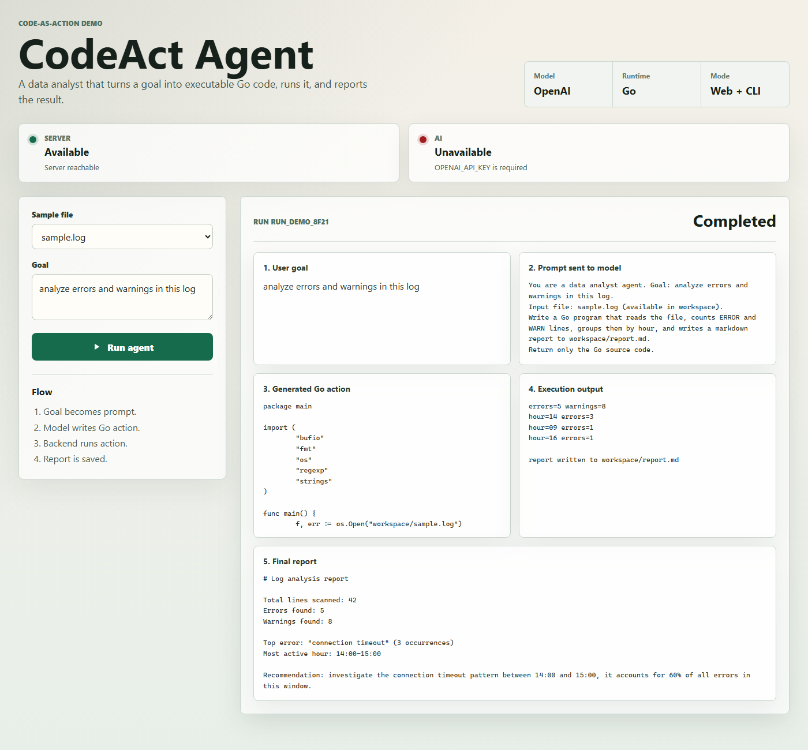
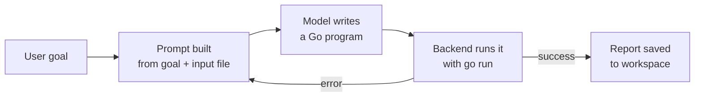

# CodeAct Agent

A Go + React demo of the **code-as-action** pattern: instead of calling a fixed set of tools, the agent asks a model to *write a program*, executes it, and retries with the execution feedback if it fails.

A frontend build is deployed at [codeact-agent.vercel.app](https://codeact-agent.vercel.app), but the Render backend it talks to is on a free tier and currently not responding — the UI will show "Server: Unavailable" until it's redeployed. Run it locally (below) for the real thing.



## The pattern

Most agent frameworks give the model a fixed menu of tools (`search`, `read_file`, `run_sql`...) and the model picks one per step. CodeAct flips that: the model's only tool is a **general-purpose programming language**. Given a goal, it writes a small Go program that does whatever the task requires, the backend runs it, and the *real* output — including compiler and runtime errors — goes back to the model as feedback for the next attempt.

This project applies that pattern to a narrow, concrete case: a data analyst agent for small local files (`.log`, `.csv`).



The UI exposes every stage of that loop instead of hiding it behind a spinner:

1. **User goal** — the plain-language task
2. **Prompt sent to model** — exactly what the model saw
3. **Generated Go action** — the program the model wrote
4. **Execution output** — what actually happened when it ran
5. **Final report** — the markdown result written to the workspace

## Stack

| Layer | Tech |
|---|---|
| Agent loop / API | Go (`net/http`, no framework) |
| Model provider | OpenAI Responses API |
| Action runtime | `go run` against a sandboxed workspace directory |
| Frontend | React 19 + Vite |
| CLI | `cmd/codeact`, same agent loop, no server needed |

## Run it locally

Install Go and the frontend dependencies:

```powershell
winget install --id GoLang.Go -e
cd web && npm install && npm run build
```

Set your OpenAI key:

```powershell
$env:OPENAI_API_KEY="your_key"
$env:CODEACT_MODEL="gpt-5.4-mini"      # optional
$env:OPENAI_BASE_URL="https://api.openai.com/v1"  # optional
```

Run the web demo:

```powershell
go run ./cmd/server
```

Open `http://localhost:8080`.

Or run the CLI directly, no server:

```powershell
go run ./cmd/codeact -goal "analyze sample log"
go run ./cmd/codeact -goal "summarize sales by category" -input sales.csv
```

## Try it

1. Pick `sample.log` as the input file.
2. Enter a goal: `analyze errors and warnings in this log`.
3. Click **Run agent**.
4. Watch the five panels fill in — prompt, generated code, execution output, report.
5. If the generated code fails to compile or panics, the agent automatically retries with the error as feedback.

## API

```
POST /api/runs
  body:     { "goal": "...", "inputFile": "sample.log" }
  response: run result with prompt, generated code, output, report, status

GET /api/runs/{id}
  response: a previously saved run result

GET /api/status
  response: backend and model-provider availability, used by the UI status strip
```

## Project structure

```
cmd/codeact      CLI entrypoint — same agent loop, no HTTP server
cmd/server       Web/API server, serves the built React app
internal/agent   The CodeAct loop and the OpenAI provider
web              React frontend (Vite)
workspace        Sample input files and generated reports
```

## Deploy

Split deployment: Vercel for the static frontend, Render for the Go backend (it needs the Go toolchain at runtime to execute generated actions).

**Render (backend)** — uses the included `render.yaml` Blueprint.

Required env vars: `OPENAI_API_KEY`, `CODEACT_ALLOWED_ORIGIN`
Optional: `CODEACT_MODEL`, `CODEACT_RUN_TIMEOUT_SECONDS`, `CODEACT_ACTION_TIMEOUT_SECONDS`

**Vercel (frontend)** — deploy the repo root (`vercel.json`) or the `web` directory directly.

Required env var: `VITE_API_BASE_URL=https://your-render-service.onrender.com`

Never commit real API keys or `.env` files.

## Security

Generated code runs locally with no sandboxing beyond the workspace directory convention — only point this at a controlled workspace, never at arbitrary user-supplied paths. Do not commit `.env`, API keys, generated runs, or generated reports.
